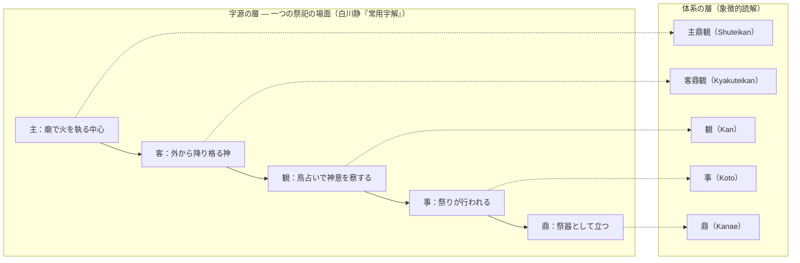

# 漢字相関マップ — 白川静『常用字解』×調和的主観主義 v0.1.1

**位置づけ**: 引用はすべて白川静『常用字解』（平凡社）による。要約・短い引用・出典明示の形で行う（【字源】）。体系との照応はすべて【象徴的読解】であり、論証ではなく布置の読みである。

本マップは〈字源の事実（白川説）〉と〈本体系による解釈〉の二層を列で分離して示す。前者は学説の紹介、後者は論証ではない読みである。

**照応度の凡例**（各行に付す）:

- **◎ 字源本体** — その字の字源説明が、そのまま体系語の由来・定義に対応する
- **○ 構造同型** — 字源の示す構造が、体系の主張と同じ形をしている
- **△ 布置** — 同じ祭祀の場に属することによる、連想的な照応

◎も含めて、いずれも【象徴的読解】であり証明ではない。ただし照応の強さには差があり、その差を隠さないことが本マップの方針である。

---

## 〇、相関の核——中核五字は一つの祭祀の場面である

個々の字の照応を見る前に、相関の背骨を示す。『常用字解』によれば、本体系の中核五字（**主・客・観・事・鼎**）は、ばらばらの字ではなく、**すべて同じ祭祀の場の字**である。

- **主** — 廟の内で神聖な火を執る、中心の人
- **客** — 廟へ外から降り格（いた）る神（客神・まろうど）
- **観** — 鳥占いによって神意を察すること
- **事** — 吹き流しを立てて行われる祭祀そのもの
- **鼎** — その場に立つ祭器

つまり——**主が火を執り、客なる神が訪れ、観によって神意が察され、事として祭りが行われ、鼎がその器として立つ。**体系の用語一式は、この一つの場面を再構成している。

個々の照応が偶然の一致ではなく**束になって効く**のは、この同場性があるからである。一字ずつなら偶然でも、五字が同じ場面を構成し、その場面の役割分担が体系の役割分担と重なることは、布置として強い。ただしこれは論証ではなく布置の読みである（→docs/positioning.md）。

以下の「五つの星座」は、この場面を構成する字形要素の家族である。

---

## 一、五つの星座（字形要素による横断構造）

本マップの55字は、五つの「星座」＝字形要素の家族に整理できる。五つはいずれも**同じ祭祀の場**を構成する。

### 星座一：口（さい）——神への言葉

祝詞を入れる器。**神と交信する言葉の家族。**

※「口（さい）」＝神への祈りの文である祝詞（のりと）を入れる器の形の字。正しい字形は「𠙵」（Unicode拡張漢字のため環境によっては表示されない）。本稿では白川学で慣用の代替表記「口（さい）」を用いる。日常語の「口（くち）」とは別の字である。

| 字 | 照応度 | 字源（白川静『常用字解』の記述） | 本体系の読解（象徴的読解） |
|---|---|---|---|
| 告 | ○ | 木の小枝に口（さい）を著けて神に告げ祈る | 観（Kan）を差し出す原型 |
| 各 | ○ | 口（さい）を供えた祈りに応えて神が天から降り**格る**。単独で降るのが各、並び降るのが皆 | 客鼎観（Kyakuteikan）の到来 |
| 客 | ◎ | 廟に降下し格る神＝客神・まろうど | 客鼎観の字源本体 |
| 昭 | △ | 口（さい）を供えて神霊の降下を祈り、降る神霊を跪いて迎える。霊威の明らかなこと | 迎える動作＝客・各と同じ身振り。「あきらか」 |
| 臨 | ○ | 口（さい）を三つ並べて祈るのに応え、**天にいる神霊が下方を臨み見る** | 他なる観の降下。「上帝、女に臨めり」 |
| 意 | ○ | 神前の言に対し、神が夜口（さい）の中に立てる**かすかな音**の意味を**おしはかる** | 客鼎観の受領と解釈。意味＝神意の推し量り |
| 知 | ○ | 矢（誓いのしるし）＋口（さい）。**神に誓ってはじめて「あきらかにし、しる」** | 知ることの根に誓約がある |
| 信 | ◎ | 人＋言。**神に誓いをたてた上で、人との間に約束したこと**＝まこと | 信じる＝存在の肯定の字源的土台。鼎と鼎の間の誓約 |
| 善 | ○ | 解廌の前で**原告と被告、二者の誓言**の神判により決する | 善は最初から複数の言（観の提供）の間で決まる——調和的主観主義の倫理と同構造 |
| 和 | ◎ | 軍門の前に口（さい）を置いて**講和を誓う**。「和なる者は、天下の達道なり」（中庸） | 両軍が残ったまま戦いを収める＝**統合なき調和**。鼎立と同型。調和の「和」の字源本体 |
| 器 | ◎ | 口（さい）を四つ並べ、清めの犬を置いた**儀礼の清められたうつわ** | 「鼎＝器」という定義語そのものが祭器 |
| 司 | △ | 口（さい）＋祭器。祝詞の儀礼を主る。伺＝神意をよみとる人 | 観測を司る者 |
| 史 | △ | 口（さい）をつけた木を捧げて祭る（内祭）。のち祭りの記録＝ふみ・歴史 | 記録＝観の保存。リポジトリの字源 |
| 占 | △ | 卜＋口（さい）。神に祈って卜い、神意を問う | 神意の観測 |
| 事 | ◎ | 史＋吹き流し。山川での国家的祭祀（外祭）→まつり・こと・つかえる | 事（Koto）の字源本体 |

### 星座二：鼎（かなえ）——祭器と契約

| 字 | 照応度 | 字源（白川静『常用字解』の記述） | 本体系の読解（象徴的読解） |
|---|---|---|---|
| 貞 | ◎ | 卜＋鼎。**鼎を使って占い、神意を問う**。結果は「ただしい・まこと」 | **主鼎観・客鼎観の字源的アンカー**。鼎を通して神意を観る行為は三千年前に一字として存在した。音「テイ」も鼎に由来 |
| 則 | ○ | 鼎＋刀。**鼎に刻んだ銘文＝契約はそのまま守るべき規則** | 原理（則）を鼎に刻む＝公開・タグ付けの字源。「原則」「規則」 |
| 剤 | ○ | 方鼎に刻んだ契約の銘文。「質剤を以て信を結ぶ」（周礼） | 契約と信の接続 |
| 具 | △ | 両手で鼎を捧げ持ち、供える物をそろえる | 鼎を捧げる身振り。「具体」 |
| 員 | ○ | 円鼎の口の丸。円鼎の数を数えた→かず・メンバー | 鼎を数える＝鼎の複数性（世界の多元） |

### 星座三：示（祭卓）——聖なる場

| 字 | 照応度 | 字源（白川静『常用字解』の記述） | 本体系の読解（象徴的読解） |
|---|---|---|---|
| 示 | △ | 祭卓の形。「かみ」。視と通用して「しめす」 | 示す＝神の卓に置く |
| 神 | △ | 申（稲妻＝神威）＋示。自然神→祖先の霊→「こころのはたらき」 | 神の意味の変遷が「こころ」に至る |
| 祭 | △ | 祭卓に手で犠牲の肉を供える | 祭祀の行為そのもの |
| 宗 | △ | 廟＋祭卓＝宗廟→本家→宗教 | 祭祀空間の中心 |
| 祖 | △ | 且（俎＝供物の台）＋示。祭られる者→はじめ・のっとる | 系譜と規範の源 |
| 禅 | △ | 天を祭る封禅の礼→位をゆずる→禅宗 | 般若心経・彼岸との接続点 |

### 星座四：目・見——観ることの家族

| 字 | 照応度 | 字源（白川静『常用字解』の記述） | 本体系の読解（象徴的読解） |
|---|---|---|---|
| 見 | ◎ | 目を強調した人の形。**「見るという行為は相手と内面的な交渉をもつ」「対象の魂をよびこむことによって新しい生命力を身につける」**（万葉集「見れど飽かぬかも」） | **相互形成の定理の字源的先取り。**観る者が観ることで変わる |
| 観 | ◎ | 雚（神聖な鳥）で鳥占いをし、**神意を察する**。みる・みきわめる。のち道観 | 観（Kan）の字源本体 |
| 望 | ○ | つま先立ち、大きな瞳で遠くを望む。**雲気を見て占う行為**、目の呪力 | 未来へ向く観 |
| 臨 | ○ | （星座一と重複）神が上から臨み見る | 降りてくる観 |

### 星座五：我・義——切ることと正しさ

| 字 | 照応度 | 字源（白川静『常用字解』の記述） | 本体系の読解（象徴的読解） |
|---|---|---|---|
| 我 | ◎ | **鋸（のこぎり）の形。**一人称は固有の字を持たず、切る道具の字を借りた仮借 | **自我＝観による切り取り、の字源的先取り。**「われ」という字そのものが切る道具 |
| 義 | ○ | 羊＋我（鋸）。犠牲の羊を鋸で切り、**完全であることを示す**→ただしい | 切ることと正しさの接続。犠・羲 |

### 星座外の重要字（人体・心・その他）

- **主**【字源】灯火の炎の象形。廟で火を執る者＝氏族の中心→ぬし。／**火**：聖火・災。
- **王**：鉞の刃＝王権の象徴。／**央**：首枷の人＝まんなか（殃のもと）。／**大**：手足を広げて立つ人の正面形。／**人**：立つ人の側面形。／**生**：草の生え出る形→うまれる・いきる——**形成の字**。
- **心系**：**魂**（云＋鬼。たましいは死後、雲気となる）／**精**（神に供える五穀の美しいもの→こころ・たましい＝精神）／**愛**（立ち去ろうとして後ろに心がひかれる人の姿）／**悪**（亞＝墓室を忌み謹む思い→にくむ→わるい）／**忘**（亡＋心。論語「憤りを發しては食を忘れ…」）。
- **行**：十字路の形。霊の行き交う所、呪術の場。**般若波羅蜜多を「行」じる、の行。**
- **彼**：仮借の代名詞。**彼岸**＝悟りの境地——真言「彼岸へ行け」の到達点。
- **英**（央音符。美しく盛んな花→すぐれる）／**昭**（星座一）／**早**（匙の仮借→はやい・あさ）／**希**（すかし織りの布→まれ→ねがう＝希望）／**調**（周＝飾った盾。「調は龢するなり」＝楽音のととのい→調和）／**全**（佩玉が備わる→まったし）／**備**（箙を背負う→そなえる）／**考**（長髪の老人＋丂。亡父→かんがえる）／**蛇**（它＝へび。巳＝自然神の代表神格。谷神）／**圧**（厭勝＝土地の邪気を鎮める呪儀）。

---

## 二、体系への写像（要約）

体系の中核語には、それぞれ照応度◎の字が最低一つ立っている——これが「相関の骨格」である。

| 体系の語 | 字源の裏づけ（『常用字解』） | 核となる◎ |
|---|---|---|
| 鼎（Kanae）＝主体世界を成立させる器 | 鼎＝祭器。器＝儀礼の清められたうつわ。貞＝鼎で神意を問う | 器・貞 |
| 観（Kan）＝形成する働き | 観＝鳥占いで神意を察する。見＝対象の魂をよびこみ新しい生命力を身につける | 観・見 |
| 物（Mono）＝観による切り取り | 我＝鋸（切る道具）→自我＝切り取られた現在の姿。物＝三説併記・未確定 | 我 |
| 事（Koto）＝関係・形成過程 | 事＝吹き流しを立てた外祭＝まつりごと | 事 |
| 主鼎観（Shuteikan） | 主＝廟の火を執る中心＋鼎＋観。音テイは貞（鼎の占い）と同源 | 貞 |
| 客鼎観（Kyakuteikan） | 客＝廟に迎えた客神。各＝単独で降り格る。昭・臨＝降りてくるものを迎える／臨み見る | 客 |
| 観の提供・受領 | 告＝神に告げる。意＝口（さい）の中の音から神意をおしはかる | — |
| 信じる＝存在の肯定 | 信＝神に誓った上での人と人との約束＝まこと | 信 |
| 調和（統合なき調和・鼎立） | 和＝軍門前の講和（両軍が残ったまま収める）。調＝楽音のととのい。善＝二者の誓言の神判 | 和 |
| 原理の公開・記録 | 則・剤＝鼎に刻んだ契約の銘文。史＝祭りの記録＝ふみ | — |

## 三、注意（公開時）

- 本マップの「本体系の読解」列はすべて【象徴的読解】。字源の記述（【字源】）は白川静『常用字解』に拠り、白川説は出発点として採用する一学説である（→docs/positioning.md）。
- 照応度（◎○△）は照応の強さの自己申告であり、◎も論証ではない。強い読みと弱い読みを混ぜて一律に見せないための区分である。
- 財・礼は未収録（追補予定）。
- 物の字源は白川自身が三説併記で未確定としている点を、体系側の照応でも誇張しない。
