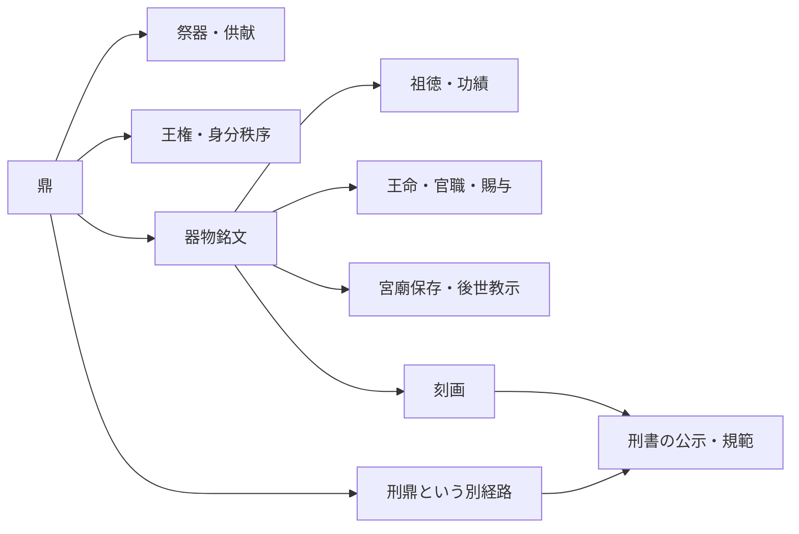

# 鼎銘と鼎の多層用法

## 要旨

中國哲學書電子化計劃（Chinese Text Project; CText）の「先秦兩漢」収録範囲で`鼎銘`を検索すると、句読点を無視する文字一致で14ヒット（13段落）、句読点を含めた一致で13ヒットする。ただし、これは14個の独立した出土器または同時代実用例を意味しない。同一銘の反復、並行伝承、引用、漢代文集の篇題、句読点をまたぐ一例が含まれる。意味上の独立した伝承・用法・作品へ正規化すると概ね10群、文字列`鼎銘`に限れば概ね9群となる。

件数より重要なのは用途である。鼎の銘は、祖徳・功績・王命・官職・賜与・奉職の誓いを記し、祭祀・宮廟で保存され、子孫と後世へ教示する媒体として記述されている。これとは別経路で、刑書を鼎へ鋳って公示する`刑鼎`の実践も伝世文献に記録される。

また、鼎には王権・政治的正統性および貴族身分秩序の徴という明確な層がある。しかし、その歴史的機能はこの一層に尽きない。食を煮て祖先へ供える祭器、王命や賜与を刻む記録媒体、功績を後世へ継ぐ器、規範を公示する器という機能が重なる。

したがって、現段階で確認できるのは、**鼎―刻銘―記録―祭祀―継承―教示―規範**という意味関係網である。この関係網は『字通』一資料に閉じず、伝世古典、出土器銘、博物館資料、香港中文大学「漢語多功能字庫」にまたがって確認できる。ただし、これだけで`則`の字形・原義・派生方向を最終証明したとはしない。

## 1. 調査上の問い

本調査は次の問いを分ける。

1. 文字列`鼎銘`は伝世文献で実際に用いられたか。
2. 鼎へ何を、何のために銘したと記述されるか。
3. 出土青銅器の銘文は、文献上の説明とどこまで整合するか。
4. `鼎＝王権の象徴`という説明は、鼎の機能を尽くすか。
5. 鼎・銘・刻画・則・規範の連関は、白川静説だけに依存するか。
6. どこからが調和的主観主義の独自の象徴的読解か。

これらを一つの「字義」へ溶かさず、検索事実、文献解釈、出土資料、字源説、体系内読解を別claimとして扱う。

## 2. CText検索の実測

- corpus: CText「先秦兩漢」
- query: `鼎銘`
- exact characters / punctuation ignored: 14 hits, 13 paragraphs
- identical including punctuation: 13 hits
- [検索統計](https://ctext.org/pre-qin-and-han?searchu=%E9%BC%8E%E9%8A%98&reqtype=stats&matchtype=exact)
- [句読点込み検索](https://ctext.org/pre-qin-and-han?searchu=%E9%BC%8E%E9%8A%98&reqtype=stats&matchtype=binary)
- [CText検索仕様](https://ctext.org/instructions/advanced-search)

### 件数の読み方

`先秦兩漢`はCText上の収録区分である。検索結果に含まれる全テキストが、その標題どおりの時代に同一形で成立したことまで、この検索だけで証明しない。とくに『孔子家語』は今本の成立・伝承過程が複雑であり、独立した先秦証人として機械的に数えない。

また、raw hitと独立した歴史事例は一致しない。

```text
raw hit 14
  ├─ 同一段落内の反復
  ├─ 同一伝承の並行文献
  ├─ 先行文献の引用
  ├─ 文集の篇題
  └─ 「鼎、銘」と句読点をまたぐ1件
       ↓ normalization
概ね10の伝承・一般論・作品群
```

## 3. 14ヒットの内訳

| 表示項目 | 文献・箇所 | raw hit | 正規化上の扱い | 確認できる用法 |
|---|---|---:|---|---|
| 1 | 『禮記』祭統・衛孔悝鼎銘の冒頭 | 1 | 同一銘群 | 祖徳・功労を記す |
| 2 | 同段落末尾「此衛孔悝之鼎銘也」 | 1 | 項目1と同一群 | 子孫へ職と教えを伝える |
| 3 | 『孔子家語』觀周・正考父鼎銘 | 1 | 『左傳』『史記』との並行伝承 | 謙恭・節倹を模範として銘す |
| 4 | 『論衡』須頌・衛孔悝鼎銘 | 1 | 『禮記』伝承の引用・再利用 | 先行する徳の記録を参照する |
| 5 | 『論衡』須頌・鼎銘一般論 | 1 | 独立一般論 | 君主の徳を頌し、鼎銘へ刻む |
| 6 | 『論衡』自紀 | 1 | 独立一般論 | 稀有な事物・事績を長く記録する |
| 7 | 蔡邕『東鼎銘』 | 1 | 文集の独立篇題 | 司空任命・功績 |
| 8 | 蔡邕『中鼎銘』 | 1 | 文集の独立篇題 | 司徒任命・徳・責任 |
| 9 | 蔡邕『西鼎銘』 | 1 | 文集の独立篇題 | 太尉任命・奉職の誓い |
| 10 | 蔡邕『鼎銘』 | 1 | 文集の独立篇題 | 系譜・徳・功績を記し、子孫が祭る |
| 11 | 蔡邕「墳前石碑」 | 1 | 句読点またぎ | 鼎を鋳て功徳を銘す。連続語`鼎銘`ではない |
| 12 | 『史記』孔子世家・正考父鼎銘 | 1 | 『左傳』との並行伝承 | 謙恭・節倹の模範 |
| 13 | 『春秋左傳』昭公七年・正考父鼎銘 | 1 | 並行伝承群の古い層 | 徳目を銘し後世へ伝える |
| 14 | 『漢書』郊祀志下 | 1 | 出土鼎解読記事 | 王命・官職・賜与・先祖の功を刻み、宮廟へ保存する |

参照先:

- [『禮記』祭統](https://ctext.org/liji/ji-tong/zh)
- [『孔子家語』觀周](https://ctext.org/kongzi-jiayu/guan-zhou)
- [『論衡』須頌](https://ctext.org/lunheng/xu-song)
- [『論衡』自紀](https://ctext.org/lunheng/zi-ji)
- [蔡邕『東鼎銘』](https://ctext.org/text.pl?node=648413&if=en)
- [蔡邕『中鼎銘』](https://ctext.org/text.pl?node=648415&if=en)
- [蔡邕『西鼎銘』](https://ctext.org/text.pl?node=648417&if=en)
- [蔡邕『鼎銘』](https://ctext.org/text.pl?node=648428&if=en)
- [蔡邕「墳前石碑」](https://ctext.org/text.pl?node=648430&if=en)
- [『史記』孔子世家](https://ctext.org/shiji/kong-zi-shi-jia)
- [『春秋左傳』昭公七年](https://ctext.org/chun-qiu-zuo-zhuan/zhao-gong-qi-nian)
- [『漢書』郊祀志下](https://ctext.org/han-shu/jiao-si-zhi-xia)

## 4. 鼎銘の用法

### 4.1 祖徳・功績の記録

『禮記』祭統は、鼎に銘があることを述べたうえで、先祖の徳善・功烈・勲労・慶賞・声名を祭器に記す働きを説明する。鼎銘は単なる所有者名でなく、祖先の行為と評価を後代へ残す媒体として理論化されている。

### 4.2 王命・官職・賜与

『漢書』郊祀志下の記事では、出土鼎の古文字を調べ、王命・官職・賜与を読み解き、大臣の子孫が先祖の功を刻み宮廟へ収めたものと説明する。蔡邕の諸篇題にも、任官、職責、功績、奉職の誓いが記される。

### 4.3 祭祀・宮廟・継承

鼎は、書記だけを目的とする平面媒体ではない。祭器として用い、宮廟へ保存し、子孫が祭るという場と実践が、記録内容と結びつく。ここでは器、銘文、祭祀、継承が一つの制度的な働きを成す。

### 4.4 後世への教示

『禮記』祭統は後世へ明示して教える機能を論じる。正考父鼎銘の並行伝承も、謙恭・節倹を模範として後代へ伝える。記録は保存されるだけでなく、後の行為を方向づける。

## 5. 刑鼎――法令は別経路で扱う

`鼎銘`14ヒットのすべてを「法令の記録」とまとめてはいけない。法文の証拠は、別の検索・別の史料である`刑鼎`から来る。

『春秋左傳』昭公二十九年には、刑書を鼎へ鋳して公示する実践が記される。孔子による制度上の評価は否定的だが、鼎へ規範的文書を固定する実践が語られている点は別に確認できる。

- [『春秋左傳』昭公二十九年](https://ctext.org/chun-qiu-zuo-zhuan/zhao-gong-er-shi-jiu-nian)

したがって、正確な書き分けは次である。

> 鼎銘の用例では、祖徳・功績・王命・官職・賜与・後世への教示が確認できる。これとは別に、刑鼎の記事は、刑書を鼎へ鋳って公示する実践を伝える。

両者は同一の14ヒットではないが、鼎が長期記録・公示・規範と結びついた文化的関係を、異なる経路から示す。

## 6. 「鼎は王権の象徴」の位置

### 6.1 否定すべき説ではない

鼎が王権・政治的正統性・貴族身分秩序の徴であったことは、重要な歴史的層である。故宮博物院の概説も、鼎を王権の象徴としつつ、原初の食器、祭祀・征伐・喪葬に用いる礼器、貴族等級の標識として説明する。[故宮博物院「鼎」](https://www.dpm.org.cn/lemmas/239373.html)

上海博物館も、鼎を等級と権力の標識とする一方、烹煮、犠牲祭祀、宴饗という用途を同時に示す。[上海博物館「大克鼎」](https://www.shanghaimuseum.net/mu/frontend/pg/article/id/P00002857)

したがって、対立する最良の方法は「王権象徴説を否定する」ことではない。**王権の層を認め、それが鼎の全機能を尽くさないことを、別資料で示す**ことである。

### 6.2 出土器銘が示す多層性

- 大克鼎: 祖先の称揚、王の冊命、職責、土地等の賜与。[上海博物館「大克鼎銘文」](https://www.shanghaimuseum.net/mu/frontend/pg/article/id/CI00000656)
- 尹光方鼎: 王からの貝の賜与、作鼎、軍事記事。[British Museum](https://www.britishmuseum.org/collection/object/A_1981-0530-1)
- 商代鼎: 亡父のために作ったことを示す銘。[Metropolitan Museum of Art](https://www.metmuseum.org/art/collection/search/49393)

これらは、政治的権威、祖先祭祀、贈与、軍事、親族記憶が、鼎という同じ器に交差しうることを示す。

### 6.3 正統性は器そのものだけにない

「問鼎」の伝承では、鼎の軽重を問うことが天下への意図を示す一方、応答は徳に重心を置く。鼎は正統性の強い徴だが、正統性を物としての鼎だけへ還元しない伝承でもある。[CText「問鼎」](https://ctext.org/dictionary.pl?char=%E5%95%8F%E9%BC%8E&if=gb)

## 7. 漢語多功能字庫との交差確認

香港中文大学「漢語多功能字庫」は、字形・出土例・解説を照合する公開学術資料として重要である。

- [`則`](https://humanum.arts.cuhk.edu.hk/Lexis/lexi-mf/search.php?word=%E5%89%87): 金文を鼎と刀の組合せとして説明し、鼎上へ文字を刻画して法則とする解説、および銘へ明晰に刻む用例を掲げる。
- [`銘`](https://humanum.arts.cuhk.edu.hk/Lexis/lexi-mf/search.php?word=%E9%8A%98): 器物上に鋳刻する文字として説明し、中山王鼎などの出土例を掲げる。
- [`鼎`](https://humanum.arts.cuhk.edu.hk/Lexis/lexi-mf/search.php?word=%E9%BC%8E): 古文字・金文資料、貞等への用法関係を示す。

この資料は、伝世古典の`鼎銘`用法とは別のclaimである。両者を交差させると、鼎上の刻画、器物銘文、記録、規範という連関が白川静説だけに閉じないことが分かる。

ただし、「漢語多功能字庫が白川説と完全に独立した学説系譜を持つ」とまでは、個別解説の引用関係を調べずに断言しない。正確には、**白川静以外の公開学術資料および伝世・出土資料にも整合する**と書く。

## 8. 字族ではなく意味関係網

`銘`は`鼎`から字形的に派生した文字ではない。したがって、ここで確認したものを「鼎の文字ファミリー」と呼ぶと、字族・声系・派生字と、文化的な関係を混同する。

推奨語は次である。

> 鼎を中心とする意味関係網

この関係網には、少なくとも次が入る。



これは字形派生図ではなく、資料で確認した用途・実践・意味の関係図である。

## 9. 本体系の象徴的読解との境界

### 資料から言えること

- 鼎へ銘を施す実践が記述され、出土器にも銘文がある。
- 祖徳・功績・王命・官職・賜与を記し、宮廟・祭祀・継承・教示と結びつく。
- 刑鼎という別経路で、鼎と規範の公示が結びつく。
- 鼎には王権・正統性・身分秩序の層がある。
- 鼎は同時に食器・祭器・祖先供献の器でもある。
- 公開学術字庫にも、鼎・刻画・銘・則を結ぶ説明と出土例がある。

### 資料だけからは言えないこと

- CTextの14ヒットを14個の独立出土器と数えること。
- すべての記事を記述どおりの同時代青銅器の直接証明とすること。
- この用例だけで`則`の字形・原義・派生方向を最終確定すること。
- 銘を鼎の派生字とすること。
- 調和的主観主義の`鼎`定義が、古代中国ですでに同じ哲学概念だったとすること。

調和的主観主義は、これらの資料関係を踏まえながら、鼎を独自に定義する。その定義は古代字義からの演繹ではなく、概念上の必要が先にあり、古い字義・用法との響き合いを命名と象徴的読解に用いたものである。

## 10. 公開正文へ推奨する短い記述

> 中國哲學書電子化計劃の「先秦兩漢」収録範囲では、「鼎銘」は句読点を無視する文字一致で14ヒットし、句読点を含む一致では13ヒットする。ただし、同一銘の反復、並行伝承、引用、漢代文集の篇題を含むため、14件の独立事例ではない。鼎銘の用例からは、祖徳・功績・王命・官職・賜与を記し、祭祀・宮廟で保存して後世へ教示する働きが確認できる。これとは別に、『左傳』の刑鼎は、刑書を鼎へ鋳って公示する実践を伝える。鼎には王権・政治的正統性の徴という層もあるが、それだけでなく、祭祀・供献・記録・継承・教示・規範を結ぶ多層的な器であった。したがって、鼎―刻銘―記録―継承―規範という関係網は、白川静説だけでなく、伝世古典・出土器・公開学術字庫にも確認できる。

## 11. 公開Wiki構造

正文を短くして研究を捨てるのではなく、短い概念ページから本稿へ降りる。

```text
concepts/ding
  ├─ 短い正準定義
  ├─ 体系内の採用来歴
  └─ research/ding/dingming-preqin-han
      ├─ CText全ヒット監査
      ├─ 王権・身分秩序
      ├─ 祭祀・祖先供献
      ├─ 官命・賜与・功績
      ├─ 刑鼎・規範
      └─ evidence/
          ├─ 伝世文献
          ├─ 出土器・博物館資料
          ├─ 漢語多功能字庫
          └─ 資料別字源claim
```

人間向けには本稿を一ページで読める形に保ち、RAGでは見出し単位にchunk化する。各chunkには次を持たせる。

- stable ID
- authority: canonical / research / evidence
- source type: 伝世文献 / 出土器 / 博物館解説 / 字源説 / 体系内読解
- claim
- source URL
- confidence
- verified date
- 上位概念と隣接研究へのリンク

この構造なら、概念の説明を求めたAIは短い正準定義を先に取得し、「なぜ鼎なのか」「歴史資料ではどう使われたか」という問いで本稿へ降りられる。

## 12. 公開上の境界

- 本稿の独自監査・要約・比較表は公開版である。
- 『字通』の全文転写は公開site・公開GitHubへ載せず、書誌と必要最小限の短い要約にする。
- CText・漢語多功能字庫・博物館ページも全文複製せず、独自要約から個別URLへリンクする。
- 画像はPublic Domain／Open Access等、再利用条件が明示されたものだけを用いる。
- 修正履歴と検証日を残し、CTextの検索件数や外部ページが変わった場合に再検証できるようにする。

## 13. 最終評価

分量は削る必要がない。むしろ、正文・研究・証拠を階層化すれば、このボリュームは調和的主観主義の概念を検索可能・検証可能・引用可能にする。

ただし、概念を固定するのは長さだけではない。

- stable ID
- 版番号
- 短い正準定義
- 全文研究ノート
- 個別証拠への直接リンク
- 資料層の分離
- 更新履歴

この組合せがあって初めて、内容の厚みがWiki・RAG・検索エンジン・AEOで働く。広まること自体は保証できないが、引用され、検証され、正確に引き出されるための面積は大きくなる。
