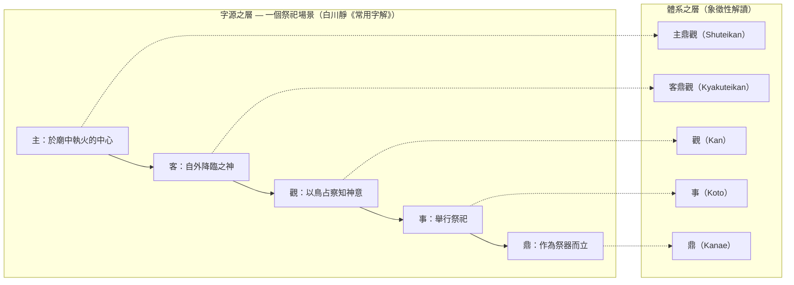

# 漢字相關圖 — 白川靜《常用字解》×調和的主觀主義 v0.1.1

**定位**：所有引用皆出自白川靜《常用字解》（平凡社）。以摘要、簡短引用、明示出處的形式進行（【字源】）。與體系的照應皆為【象徵性解讀】，並非論證，而是布置的讀解。

本圖將〈字源的事實（白川說）〉與〈本體系的詮釋〉二層以欄位分離呈現。前者為學說的介紹，後者為並非論證的讀解。

**照應度凡例**（附於各行）：

- **◎ 字源本體** — 該字的字源說明，直接對應於體系語的由來、定義
- **○ 結構同型** — 字源所示的結構，與體系的主張具有相同的形態
- **△ 布置** — 因同屬一個祭祀場域而產生的、聯想性的照應

包含◎在內，任何一者皆為【象徵性解讀】而非證明。然而照應的強度有所差異，不隱藏此差異乃本圖的方針。

---

## 〇、相關的核心——中核五字乃一個祭祀場景

在檢視各個字的照應之前，先呈現相關的脊梁。依《常用字解》，本體系的中核五字（**主・客・觀・事・鼎**）並非各自零散之字，而是**皆屬同一祭祀場域之字**。

- **主** — 於廟內執掌神聖之火的、中心之人
- **客** — 自外降臨（格）於廟之神（客神、賓客）
- **觀** — 藉由鳥占察知神意
- **事** — 豎立吹流（旗幟）而舉行的祭祀本身
- **鼎** — 立於該場的祭器

也就是說——**主執掌火，客之神來訪，藉由觀而察知神意，作為事而舉行祭祀，鼎作為其器而立。**體系的整套用語，正是重構了這一個場景。

各個照應之所以並非偶然的巧合、而是**成束地發揮作用**，正因為有此同場性。若逐字而論或許為偶然，但五字構成同一場景，且該場景的角色分工與體系的角色分工相互重疊，作為布置而言是強的。然而這並非論證，而是布置的讀解（→docs/positioning.md）。

以下的「五個星座」，即構成此場景的字形要素之家族。

---

## 一、五個星座（依字形要素的橫斷結構）

本圖的55字，可整理為五個「星座」＝字形要素的家族。五者皆構成**同一祭祀場域**。

### 星座一：口（sai，祝詞之器）——獻給神的言語

盛裝祝詞的器皿。**與神交流之言語的家族。**

※「口（sai）」＝盛裝祝詞（向神祈禱之文）之器皿形狀的字。正確字形為「𠙵」（因屬 Unicode 擴充漢字，於某些環境無法顯示）。本稿採用白川學慣用的代替表記「口（sai）」。與日常語的「口（kuchi，嘴）」乃不同之字。

| 字 | 照應度 | 字源（白川靜《常用字解》的記述） | 本體系的讀解（象徵性解讀） |
|---|---|---|---|
| 告 | ○ | 於樹木小枝上繫著口（sai，祝詞之器）向神告祈 | 獻出觀（Kan，中文讀音 guān）的原型 |
| 各 | ○ | 回應供奉口（sai）之祈禱，神自天而降**格（降臨）**。單獨降臨者為各，並列降臨者為皆 | 客鼎觀（Kyakuteikan）的到來 |
| 客 | ◎ | 降臨於廟而格之神＝客神、賓客 | 客鼎觀的字源本體 |
| 昭 | △ | 供奉口（sai）以祈神靈降臨，跪迎降臨之神靈。靈威顯明之意 | 迎接的動作＝與客、各相同的身姿。「明」 |
| 臨 | ○ | 回應並列三個口（sai）之祈禱，**在天之神靈俯臨下方而視** | 他者之觀的降臨。「上帝臨女」 |
| 意 | ○ | 對於神前之言，**揣度**神於夜間在口（sai）中所發之**微弱聲響**的意義 | 客鼎觀的受領與解讀。意義＝對神意的揣度 |
| 知 | ○ | 矢（誓約的標記）＋口（sai）。**向神起誓方能「明辨而知」** | 「知」的根柢中有誓約 |
| 信 | ◎ | 人＋言。**在向神起誓的基礎上、與人之間所立的約定**＝誠 | 相信＝存在肯定的字源基礎。鼎與鼎之間的誓約 |
| 善 | ○ | 於解廌之前，藉由**原告與被告、二者誓言**的神判而決斷 | 善從一開始便在複數之言（觀的提供）之間決定——與調和的主觀主義的倫理同構 |
| 和 | ◎ | 於軍門之前置口（sai）而**誓和**。「和也者，天下之達道也」（中庸） | 兩軍俱存而止戰＝**無整合的調和**。與鼎立同型。調和之「和」的字源本體 |
| 器 | ◎ | 並列四個口（sai）、置以潔淨之犬的**經儀禮潔淨之器皿** | 「鼎＝器」這一定義語本身即為祭器 |
| 司 | △ | 口（sai）＋祭器。主掌祝詞之儀禮。伺＝解讀神意之人 | 主掌觀測者 |
| 史 | △ | 捧持繫有口（sai）之木而祭（內祭）。其後為祭祀的記錄＝文書、歷史 | 記錄＝觀的保存。儲存庫（repository）的字源 |
| 占 | △ | 卜＋口（sai）。向神祈禱而卜問，探問神意 | 神意的觀測 |
| 事 | ◎ | 史＋吹流（旗幟）。於山川舉行的國家祭祀（外祭）→祭祀、事、侍奉 | 事（Koto，中文讀音 shì）的字源本體 |

### 星座二：鼎（Kanae，中文讀音 dǐng）——祭器與契約

| 字 | 照應度 | 字源（白川靜《常用字解》的記述） | 本體系的讀解（象徵性解讀） |
|---|---|---|---|
| 貞 | ◎ | 卜＋鼎。**使用鼎占卜，探問神意**。其結果為「正、誠」 | **主鼎觀・客鼎觀的字源之錨**。透過鼎觀神意的行為，早在三千年前便以一字之姿存在。其字音「tei」（日語音讀）亦源自鼎 |
| 則 | ○ | 鼎＋刀。**刻於鼎上的銘文＝契約即應照樣遵守的規則** | 將原理（則）刻於鼎＝公開、標記（tagging）的字源。「原則」「規則」 |
| 劑 | ○ | 刻於方鼎的契約銘文。「以質劑結信」（周禮） | 契約與信的連結 |
| 具 | △ | 以雙手捧持鼎，備齊供奉之物 | 捧鼎的身姿。「具體」 |
| 員 | ○ | 圓鼎口部之圓。數算圓鼎之數→數目、成員 | 數算鼎＝鼎的複數性（世界的多元） |

### 星座三：示（祭卓）——神聖之場

| 字 | 照應度 | 字源（白川靜《常用字解》的記述） | 本體系的讀解（象徵性解讀） |
|---|---|---|---|
| 示 | △ | 祭卓之形。「神」。與視通用而作「示（顯示）」 | 示＝置於神之卓 |
| 神 | △ | 申（閃電＝神威）＋示。自然神→祖先之靈→「心的作用」 | 神之意義的變遷抵達「心」 |
| 祭 | △ | 以手將犧牲之肉供於祭卓 | 祭祀行為本身 |
| 宗 | △ | 廟＋祭卓＝宗廟→本家→宗教 | 祭祀空間的中心 |
| 祖 | △ | 且（俎＝供物之台）＋示。受祭者→始、效法 | 系譜與規範之源 |
| 禪 | △ | 祭天的封禪之禮→讓位→禪宗 | 與般若心經・彼岸的連接點 |

### 星座四：目・見——「觀」的家族

| 字 | 照應度 | 字源（白川靜《常用字解》的記述） | 本體系的讀解（象徵性解讀） |
|---|---|---|---|
| 見 | ◎ | 強調眼目的人形。**「看這一行為與對象有著內在的交涉」「藉由喚入對象之魂而獲得新的生命力」**（萬葉集「見れど飽かぬかも」） | **相互形成定理的字源性先聲。**觀者因觀而改變 |
| 觀 | ◎ | 以雚（神聖之鳥）行鳥占，**察知神意**。看、審視。其後為道觀 | 觀（Kan）的字源本體 |
| 望 | ○ | 踮腳而立，以大眼眺望遠方。**觀雲氣而占卜的行為**、眼目的咒力 | 朝向未來之觀 |
| 臨 | ○ | （與星座一重複）神自上俯臨而視 | 降臨而來之觀 |

### 星座五：我・義——切割與正確

| 字 | 照應度 | 字源（白川靜《常用字解》的記述） | 本體系的讀解（象徵性解讀） |
|---|---|---|---|
| 我 | ◎ | **鋸子之形。**第一人稱本無固有之字，乃借用切割工具之字的假借 | **自我＝藉由觀而截取，此一觀念的字源性先聲。**「我」這個字本身即是切割工具 |
| 義 | ○ | 羊＋我（鋸）。以鋸切割犧牲之羊，**表示其完全**→正 | 切割與正確的連結。犧・羲 |

### 星座外的重要字（人體・心・其他）

- **主**【字源】燈火火焰的象形。於廟中執火者＝氏族的中心→主。／**火**：聖火、災。
- **王**：鉞之刃＝王權的象徵。／**央**：戴首枷之人＝正中（殃之本源）。／**大**：張開手足而立之人的正面形。／**人**：站立之人的側面形。／**生**：草木萌生之形→出生、生存——**形成之字**。
- **心之系**：**魂**（云＋鬼。魂魄於死後化為雲氣）／**精**（供神的五穀之精美者→心、魂＝精神）／**愛**（欲離去而心繫於後之人的姿態）／**惡**（亞＝忌憚謹慎於墓室之思→憎惡→惡）／**忘**（亡＋心。論語「發憤忘食…」）。
- **行**：十字路之形。靈魂往來之處、咒術之場。**修「行」般若波羅蜜多之「行」。**
- **彼**：假借的代名詞。**彼岸**＝覺悟的境地——真言「渡向彼岸」的到達點。
- **英**（以央為聲符。美麗繁盛之花→傑出）／**昭**（見星座一）／**早**（匙的假借→早、晨）／**希**（透孔織法之布→稀→祈願＝希望）／**調**（周＝裝飾的盾。「調，龢也」＝樂音的協調→調和）／**全**（佩玉齊備→完全）／**備**（背負箭袋→準備）／**考**（長髮老人＋丂。亡父→思考）／**蛇**（它＝蛇。巳＝自然神的代表神格。谷神）／**壓**（厭勝＝鎮壓土地邪氣的咒儀）。

---

## 二、對體系的映射（摘要）

體系的中核語中，各自至少立有一個照應度◎之字——這便是「相關的骨架」。

| 體系之語 | 字源的佐證（《常用字解》） | 作為核心的◎ |
|---|---|---|
| 鼎（Kanae）＝使主體世界成立之器 | 鼎＝祭器。器＝經儀禮潔淨的器皿。貞＝以鼎探問神意 | 器・貞 |
| 觀（Kan）＝形成的作用 | 觀＝以鳥占察知神意。見＝喚入對象之魂而獲得新的生命力 | 觀・見 |
| 物（Mono，中文讀音 wù）＝藉由觀的截取 | 我＝鋸（切割工具）→自我＝被截取的當下之姿。物＝三說並列・未定 | 我 |
| 事（Koto）＝關係・形成過程 | 事＝豎立吹流的外祭＝政事 | 事 |
| 主鼎觀（Shuteikan） | 主＝執掌廟火的中心＋鼎＋觀。字音「tei」與貞（以鼎占卜）同源 | 貞 |
| 客鼎觀（Kyakuteikan） | 客＝迎入廟中的客神。各＝單獨降臨而格。昭・臨＝迎接降臨者／俯臨而視 | 客 |
| 觀的提供・受領 | 告＝向神告祈。意＝從口（sai）中之音揣度神意 | — |
| 相信＝存在的肯定 | 信＝在向神起誓基礎上的人與人之約定＝誠 | 信 |
| 調和（無整合的調和・鼎立） | 和＝軍門前的講和（兩軍俱存而止息）。調＝樂音的協調。善＝二者誓言的神判 | 和 |
| 原理的公開・記錄 | 則・劑＝刻於鼎的契約銘文。史＝祭祀的記錄＝文書 | — |

## 三、注意（公開時）

- 本圖的「本體系的讀解」欄皆為【象徵性解讀】。字源的記述（【字源】）依據白川靜《常用字解》，白川說乃作為出發點而採用的一種學說（→docs/positioning.md）。
- 照應度（◎○△）為照應強度的自我申報，即便是◎亦非論證。此區分旨在避免將強讀解與弱讀解混為一談、一律呈現。
- 財・禮尚未收錄（預定補入）。
- 關於物的字源，白川本人以三說並列而視為未定，此點在體系一側的照應中亦不予誇大。
